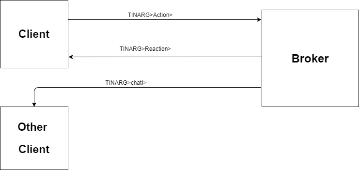

## TINARG

# This Is Not A Runescape Game

Om dit spel te kunnen spelen, moet u de client gebruiken.
Eerst moet u uw naam geven, zodat de service weet wie u bent.

De bedoeling is om met de dobbelsteen te gooien en vooruitgang maken. Meer zoals een ganzenbord, dus zeker geen runescape. 
Op verschillende vakjes staan vijanden. Deze moeten verslaan worden om level up te gaan, zodat de boss van dit level verslaan kan worden.
Nog niet het verhoopte level om de boss te verslaan? Ga dan terug naar de start van dit level.

Op de onderstaande afbeelding is te zien hoe het speelveld van het eerste level eruit zou zien (Geen beelden van de echte gameplay). In de eerste paar vakjes en verder om de 2 vakjes zitten vijanden verscholen. Op vakje 10 zit een minibaas. Bij smurfette krijgt u 2 levels erbij.

Uiteindelijk bij level 20 is er de eerste boss. Deze kan enkel verslaan worden op level 10. Als dit niet bereikt is, moet de speler terug naar vakje 11. Bij het verslaan van de boss, krijgt de speler een trofee. 

<p align="center"></p>

In dit spel hoeven de spelers geen beurt af te wachten. Het wordt wel moeilijker per level.

U kan de volgende commando's gebruiken in het spel:

```
login
shutdown
list players
get position
get level
roll dice
logout
chat

```

`login`: Het eerste commando dat moet ingevuld worden. Hierbij betreedt u het spel en werken alle andere commando's.
Als u al ingelogd bent, zal de service dit ook laten weten.

`shutdown`: Dit sluit de service af. Dan stopt het helemaal. 
Dit commando werkt enkel als speler Jethro (That's me) het ingeeft.

`List players`: Toont alle ingelogde spelers.

`get position`: Toont uw huidige positie op het spelbord.

`get level`: Toont het level dat u op dat moment heeft.

`roll dice`: Rol de dobbelsteen en krijg een nieuwe positie.

`logout`: Hierbij verlaat u het spel.

`chat`: Bij de command chat hoort altijd >[Naam ontvanger]>[Boodschap]. Anders werkt deze niet en stuurt de service, letterlijk, niets naar niemand. Voorbeeld: chat>Jethro>Hello world!

## Samenstelling commando's

De ingegeven commando's worden automatisch op een bepaalde topic geplaatst en op de broker verzonden. Als login wordt ingegeven is dit dus `TINARG>Action>[Naam speler]>login>`.

De service subscribet dan op TINARG>Action en stuurt diens bericht dan terug als `TINARG>Reaction>[Naam speler]>[Terugkomend bericht]>`.

Wanneer de client het commando `chat` gebruikt, zal de service naar het TINARG>Reaction bericht ook naar de genoemde speler het bericht sturen. Dit wordt dan `TINARG>chat!>[Naam ontvanger]>[Naam verzender]>[Bericht]>`

Hiervoor doet de client aan multithreading. Op een constant runnende task speelt deze het spel en gebruikt de topics `Action` en `Reaction`. Op de andere constant runnende task zal deze dan de chatberichten ontvangen. Hierbij wordt hier op de topic `chat!` subscribed.

<p align="center"></p>
